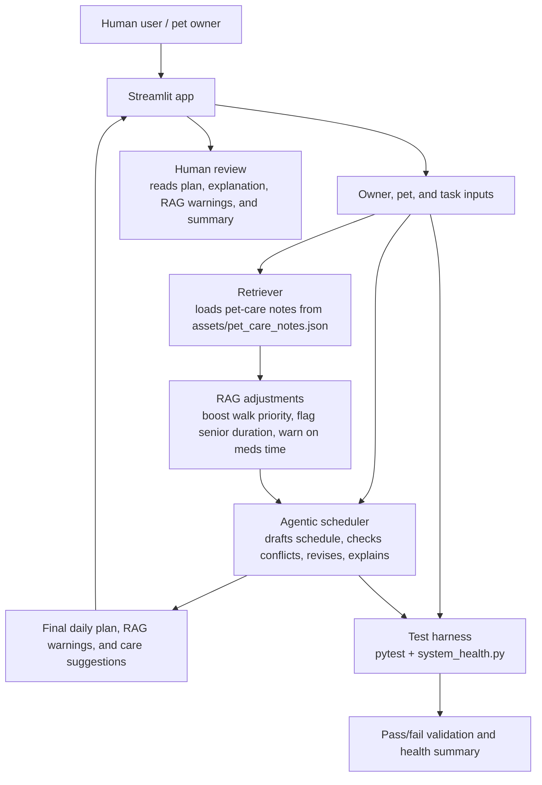

# PawPal+ - AI Pet Care Planner

## Original Project

My original project from Modules 1-3 was **PawPal**. In that version, the goal was to let a pet owner store pets, add care tasks, and generate a basic daily plan. **PawPal+** extends that foundation into a more complete AI-assisted planning system with recurrence handling, conflict detection, retrieval-based scheduling decisions, an explicit multi-step planning flow, and a built-in system-health report.

## Title And Summary

**PawPal+** is a pet care planning assistant that helps a busy pet owner organize walks, feeding, medication, grooming, and enrichment tasks into a daily schedule. It matters because it shows how an AI-supported workflow can turn real-world constraints like time windows, priority, and recurring routines into a clear plan that a human can review and trust.

## Loom Video Link

https://www.loom.com/share/c90c57a9680a42c6ad94e947678e73d2

## Architecture Overview

PawPal+ is organized into three layers: the Streamlit UI, the scheduling and reasoning core, and the evaluation tools. The UI collects owner, pet, and task input; `pawpal_system.py` filters tasks, applies RAG-driven scheduling adjustments retrieved from `assets/pet_care_notes.json`, builds a draft schedule, reviews conflicts, and explains the final result; and the tests plus health-check script verify that the main behaviors still work.

The RAG step actively changes how the schedule is built — retrieved notes boost task priorities, flag unsafe durations for senior pets, and warn about missing medication times — rather than only appending text to the explanation.



## Setup Instructions

1. Create and activate a virtual environment.

	```powershell
	python -m venv .venv
	.\.venv\Scripts\Activate.ps1
	```

2. Install the dependencies.

	```powershell
	pip install -r requirements.txt
	```

3. Run the Streamlit app.

	```powershell
	streamlit run app.py
	```

4. Run the command-line demo if you want a text-only walkthrough.

	```powershell
	python main.py
	```

5. Run the automated test suite.

	```powershell
	python -m pytest tests/test_pawpal.py
	```

6. Run the built-in system health check.

	```powershell
	python system_health.py
	```

## Sample Interactions

### Example 1: RAG boosts walk priority before a feed task

Input: Add a dog named Rex (age 4). Add a `Morning walk` task (priority 3, category `walk`) and a `Breakfast` task (priority 3, category `feed`). Generate the schedule.

AI output: The retriever finds the `dog_walk_timing` note in `pet_care_notes.json`, which covers both the `walk` and `feed` categories. Because Rex has both task types, the RAG adjustment step boosts `Morning walk` from priority 3 to priority 4, placing it before `Breakfast` in the schedule. The Plan explanation shows: `RAG (walk-before-feed): 'Morning walk' (Rex) priority boosted 3 → 4 so it schedules before the feed task.`

### Example 2: RAG flags a long task for a senior pet

Input: Add a dog named Luna (age 10). Add a `Morning walk` task with duration `45` minutes, category `walk`. Generate the schedule.

AI output: The retriever finds the `senior_pet_routine` note, which applies to pets aged 8 and older. Because Luna is 10 and the walk is 45 minutes, the RAG step surfaces a warning: `RAG (senior pet): 'Morning walk' (Luna, age 10) is 45 min — consider shortening to ≤30 min for a senior pet.` The task still schedules, but the owner is advised to reduce the duration.

### Example 3: RAG warns about medication with no fixed time

Input: Add any pet. Add a `Daily meds` task, category `meds`, with no fixed start time checked. Generate the schedule.

AI output: The retriever finds the `medication_priority` note. Because the task has no `scheduled_start` or preferred time set, the RAG step warns: `RAG (medication consistency): 'Daily meds' has no fixed time — set a consistent daily time to avoid missed doses.`

### Example 4: Detecting a scheduling conflict

Input: Add two pets. Give each a task fixed at `08:00` that overlap in duration.

AI output: The scheduler keeps the plan visible, then flags the overlap with warnings such as `both start at 08:00` and `overlaps`, so the human can review the conflict before relying on the schedule.

### Example 5: Rescheduling a recurring task

Input: Mark a daily medication task as complete.

AI output: The system marks the task complete and automatically creates the next occurrence for the following day, preserving the recurring care routine without re-entering the task.

## Design Decisions

I separated the project into a model layer, a planning layer, and a presentation/evaluation layer so the scheduling logic could be tested independently from the UI. That trade-off keeps the system easier to understand and verify, even though the schedule generator is still rule-based rather than an optimal solver.

I also made the planning process visible. Instead of showing only a final answer, the app now shows the intermediate workflow steps, which makes the system easier to explain and easier to trust. For a small daily care planner, clarity matters more than complexity.

Another important choice was associating each task with a specific pet. That reduces ambiguity when the owner has more than one pet and makes filtering, explanations, and conflict checking more meaningful.

The most significant design decision in the final version was making RAG behavioral rather than cosmetic. Earlier, retrieved notes only appeared in the explanation text. After revision, the same notes actively change scheduling outcomes: a walk-before-feed note boosts the walk task's effective priority, a senior-pet note flags tasks that are too long for older animals, and a medication-consistency note warns when a meds task lacks a fixed time. This means the knowledge base genuinely affects what gets scheduled and when, not just what the plan says about itself.

## Testing Summary

The test suite checks task filtering, priority-based scheduling, owner availability windows, conflict detection, recurring task rescheduling, and summary generation. In addition to `pytest`, the `system_health.py` script gives a pass/fail health report for core scheduler behaviors, and `pawpal.log` records every scheduling decision, RAG adjustment, conflict, and error at runtime.

6 out of 6 tests passed. The RAG behavioral rules were verified manually: the walk-before-feed boost correctly reorders tasks when both task types exist for the same pet; the senior-pet flag fires for pets aged 8 and above with tasks over 30 minutes; and the medication warning fires for any meds task with no fixed time set.

What still does not exist is a full optimization engine. The scheduler is intentionally greedy, so lower-priority tasks can remain unscheduled when time is tight. The RAG priority boost is also capped at +1 above the feed task, so a very large priority gap between a walk and a feed task may not be fully corrected. That trade-off is acceptable for this project because the app is designed to be understandable and reliable rather than mathematically optimal.

## Reflection

This project taught me that AI systems are most effective when they follow a clear workflow: input, planning, review, and human verification. I also learned that good problem-solving is often about choosing the right amount of complexity, then validating it with tests and readable explanations instead of adding features that are hard to trust.

AI is not just about what works, but about what is responsible. My system is limited because it uses rule-based scheduling and a small local knowledge base, so it can reflect incomplete guidance, simplify context too aggressively, and miss cases that a more advanced planner might handle. It could also be misused if someone treated the schedule as medical or safety advice without human judgment, so the project is designed to keep explanations visible, surface conflicts and unscheduled tasks, and leave the final decision to the owner.

What surprised me most while testing reliability was how much confidence came from a few focused checks: conflict detection, recurring-task rescheduling, and availability windows mattered more than trying to optimize every schedule perfectly. I also learned that testing the system’s failures was useful, because it showed me where the app should warn the user instead of pretending everything is fine.

My collaboration with AI was helpful when it suggested a clearer relationship between pets and tasks and when it helped me organize the planning logic into separate steps. One flawed suggestion was to hide or automatically resolve missing or overdue care tasks; I rejected that because it would reduce transparency and could make the app less trustworthy in a real pet-care setting.

## Key Features

- Pet, owner, and task management
- Priority-based daily planning with RAG-driven priority adjustments
- Time-window scheduling with flexible availability blocks
- Recurring task support for daily and weekly routines
- Conflict warnings for overlapping tasks
- RAG behavioral rules: walk-before-feed boost, senior pet duration flag, medication consistency warning
- Retrieval-augmented explanations and care suggestions
- Visible agentic planning steps
- Structured logging to `pawpal.log`
- Built-in system-health reporting

## Additional Features

These features go beyond the core requirements and map to the optional rubric items.

- RAG Enhancement: present. PawPal+ retrieves guidance from `assets/pet_care_notes.json` and uses it to actively change scheduling behavior — boosting walk task priority when a feed task exists for the same pet, flagging tasks that are too long for senior pets, and warning when a medication task has no fixed time. Retrieved notes also appear in the `Why:` explanation for each scheduled task.
- Agentic Workflow Enhancement: present. The planner executes a multi-step process (read inputs → apply RAG adjustments → draft schedule → check conflicts → explain) and surfaces each step visibly in the UI.
- Test Harness or Evaluation Script: present. `system_health.py` runs scheduler checks and prints a pass/fail health summary. `pawpal.log` records all scheduling decisions, RAG adjustments, and errors at runtime.
- Fine-Tuning or Specialization: not present. The project uses rule-based scheduling and local retrieval, but does not fine-tune a model or use synthetic training data.


